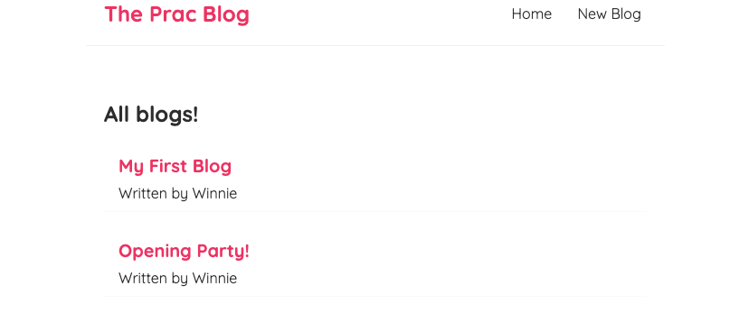
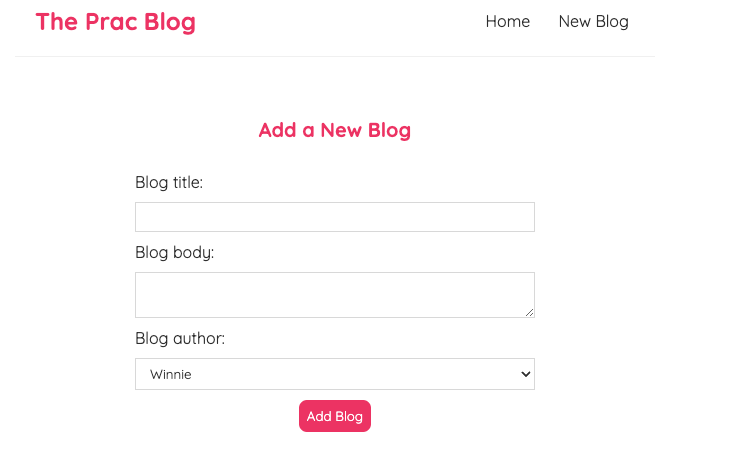
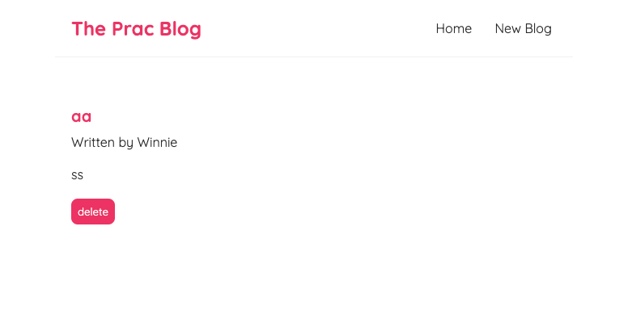

# Getting Started with Create React App

This project is a basic blog management system based on React, which cover the use of useEffect, useState hooks and router. It realize the basic blog CRUD operations.
This project was bootstrapped with [Create React App](https://github.com/facebook/create-react-app).

## Dependency

Runs the command: npm install to install the dependencies of this project.

## Fake API

Runs the app fake backend API part with json server.\
To realize the basic CRUD, you can run command: npx json-server --watch data/db.json --port 8000.

## Available Scripts

In the project directory, you can run different scripts in package.json file, such as:

### `npm start`

Runs the app in the development mode.\
Open [http://localhost:3000](http://localhost:3000) to view it in your browser.

The page will reload when you make changes.\
You may also see any lint errors in the console.

### Screenshots

Home

BlogCreate

BlogDetail

